# Komunikasi Data dan Jaringan Komputer — Modul 2

## Table of Contents

## 1. Pembuatan Topologi Mendasar

**Goal:** Pembuatan Topologi Mendasarmana Client melibatkan Eonwe (Router), l Client dan Elwing (West Subnet), Cirdan, Elrond, dan Maglor (East Subnet), dan Sirion, Tirion, Valmar, Lindon, dan Vingilot (DMZ Subnet).

### 1.1 Pengalamatan IP Address

Berikut merupakan tabel referensi dari keseluruhan IP Address yang telah kami konfigurasi pada modul ini.

| Name         | Location | IP Address  | Netmask         | Default Gateway | Description                |
| ------------ | -------- | ----------- | --------------- | --------------- | -------------------------- |
| **Eonwe**    | Router   | `10.72.1.1` | `255.255.255.0` | -               | West Subnet Gateway (eth1) |
|              |          | `10.72.2.1` | `255.255.255.0` | -               | East Subnet Gateway (eth2) |
|              |          | `10.72.3.1` | `255.255.255.0` | -               | DMZ Subnet Gateway (eth3)  |
| **Earendil** | West     | `10.72.1.2` | `255.255.255.0` | `10.72.1.1`     | West Client                |
| **Elwing**   | West     | `10.72.1.3` | `255.255.255.0` | `10.72.1.1`     | West Client                |
| **Cirdan**   | East     | `10.72.2.2` | `255.255.255.0` | `10.72.2.1`     | East Client                |
| **Elrond**   | East     | `10.72.2.3` | `255.255.255.0` | `10.72.2.1`     | East Client                |
| **Maglor**   | East     | `10.72.2.4` | `255.255.255.0` | `10.72.2.1`     | East Client                |
| **Sirion**   | DMZ      | `10.72.3.2` | `255.255.255.0` | `10.72.3.1`     | Reverse Proxy              |
| **Tirion**   | DMZ      | `10.72.3.3` | `255.255.255.0` | `10.72.3.1`     | DNS Master (ns1)           |
| **Valmar**   | DMZ      | `10.72.3.4` | `255.255.255.0` | `10.72.3.1`     | DNS Slave (ns2)            |
| **Lindon**   | DMZ      | `10.72.3.5` | `255.255.255.0` | `10.72.3.1`     | Static Web                 |
| **Vingilot** | DMZ      | `10.72.3.6` | `255.255.255.0` | `10.72.3.1`     | Dynamic Web                |

> [!NOTE]
> Netmasking done with `/16` CIDR Notation.
> Artinya menggunakan netmask `255.255.0.0` = `11111111.11111111.00000000.00000000`, dengan 10.72.xx.xx sebagai definisi IP Address lokal dalam konfigurasi ini.

### 1.2 Konfigurasi Tiap Network Node

Berikut adalah _network configuration_ dari tiap _network node_ yang ada pada modul kali ini.

**1. Eonwe**

```
auto eth0
iface eth0 inet dhcp

auto eth1
iface eth1 inet static
         address 10.72.1.1
         netmask 255.255.255.0

auto eth2
iface eth2 inet static
         address 10.72.2.1
         netmask 255.255.255.0

auto eth3
iface eth3 inet static
         address 10.72..1
         netmask 255.255.255.0
```

> [!NOTE]
> Gateway router di sini telah ditentukan sebagai `10.72.1.1`, `10.72.2.1`, dan `10.72.3.1`

**2. Earendil**

```
auto eth0
iface eth0 inet static
        address 10.72.1.2
        netmask 255.255.255.0
        gateway 10.72.1.1
```

**3. Elwing**

```
auto eth0
iface eth0 inet static
        address 10.72.1.3
        netmask 255.255.255.0
        gateway 10.72.1.1
```

**4. Cirdan**

```
auto eth0
iface eth0 inet static
        address 10.72.2.2
        netmask 255.255.255.0
        gateway 10.72.2.1
```

**5. Elrond**

```
auto eth0
iface eth0 inet static
        address 10.72.2.3
        netmask 255.255.255.0
        gateway 10.72.2.1
```

**6. Maglor**

```
auto eth0
iface eth0 inet static
        address 10.72.2.4
        netmask 255.255.255.0
        gateway 10.72.2.1
```

**7. Sirion**

```
auto eth0
iface eth0 inet static
        address 10.72.3.2
        netmask 255.255.255.0
        gateway 10.72.3.1
```

**8. Tirion**

```
auto eth0
iface eth0 inet static
        address 10.72.3.3
        netmask 255.255.255.0
        gateway 10.72.3.1
```

**9. Valmar**

```
auto eth0
iface eth0 inet static
        address 10.72.3.4
        netmask 255.255.255.0
        gateway 10.72.3.1
```

**10. Lindon**

```
auto eth0
iface eth0 inet static
        address 10.72.3.5
        netmask 255.255.255.0
        gateway 10.72.3.1
```

**11. Vingilot**

```
auto eth0
iface eth0 inet static
        address 10.72.3.6
        netmask 255.255.255.0
        gateway 10.72.3.1
```

> [!NOTE]
> Konfigurasi di atas tidak jauh berbeda antara satu dengan yang lainnya.
> Perbedaan konfigurasi di atas adalah pada `Address` dan `Gateway`.
> Perbedaan tergantung dari lokasi Client berada di subnet mana dan merupakan Client urutan ke berapa pada subnet tersebut.

### 1.3 Hasil Topoplogi

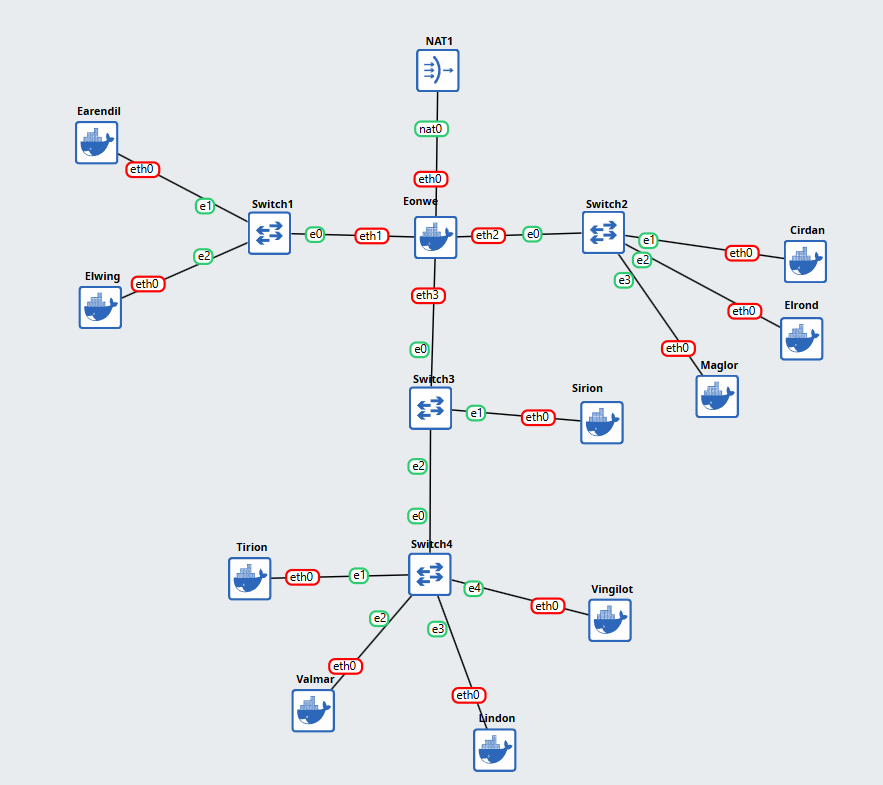

### 1.4 Keterangan

Jadi, berdasarkan dari topologi di atas terbentuk beberapa subnet yang dapat dikelompokkan sesuai dengan arah lokasi subnet masing-masing, seperti `Jalur Barat`, `Jalur Timur`, dan `Pelabuhan DMZ` sendiri merupakan subnet mereka tersendiri.

Dengan struktur topologi yang dibentuk di atas, maka secara natural, perangkat-perangkat pada subnet Barat dan subnet Timur, maupun yang berarti di pelabuhan DMZ, ketiga-tiganya tidak dapat secara langsung berbicara dengan satu sama lain, tetapi hanya dapat "menitipkan pesan" melalui gerbang, yaitu Eonwe (router), dimana fungsionalitas tersebut pun harus dikonfigurasi sendiri secara eksplisit sendiri.

Sementara itu, untuk `Pelabuhan DMZ` sendiri, sebenarnya merujuk pada DMZ (Demilitarized Zone) yang, apabila pada topologi ini, merupakan subnet sendiri yang dikhususkan untuk ditempatkan server-server yang perlu diakses dari internet (seperti web server, DNS server, dll.). Tujuan dari sistem ini adalah untuk keamanan sendiri, sehingga ketika ada yang berhasil masuk ke dalam DMZ mereka tidak akan secara langsung mendapatkan akses pada jaringan internal yang mengandung data-data sensitif.

## 2. Mangaktifkan WAN dan Penerusan Trafik Keluar di Router

**Goal:** Memastikan jalur WAN di router aktif dan NAT meneruskan trafik keluar bagi seluruh alamat internal sehingga host di dalam dapat mencapai layanan di luar menggunakan IP address.

### 2.1 Konfigurasi

Berikut merupakan konfigurasi yang kami tambahkan pada Eonwe (router) untuk mencapai tujuan yang diminta pada soal ini.

**Eonwe**

```
auto eth0
iface eth0 inet dhcp
         up apt-get update && apt-get install -y iptables bind9 dnsutils
         up sysctl -w net.ipv4.ip_forward=1
         up iptables -t nat -A POSTROUTING -o eth0 -j MASQUERADE -s 10.72.0.0/16

auto eth1
iface eth1 inet static
	address 10.72.1.1
	netmask 255.255.255.0

auto eth2
iface eth2 inet static
	address 10.72.2.1
	netmask 255.255.255.0

auto eth3
iface eth3 inet static
	address 10.72.3.1
	netmask 255.255.255.0
```

-   `sysctl -w net.ipv4.ip_forward=1`: memastikan router dapat meneruskan traffic keluar NAT.
-   `iptables -t nat -A POSTROUTING -o eth0 -j MASQUERADE -s 10.72.0.0/16`: memastikan request yang dilakukan oleh client dari IP `10.72.x.x` akan dianggap sebagai dari jaringan lokal.

**Client**

```
auto eth0
iface eth0 inet static
	address 10.72.x.y
	netmask 255.255.255.0
	gateway 10.72.x.1
        up echo "nameserver 10.72.3.3" > /etc/resolv.conf
        up echo "nameserver 10.72.3.4" >> /etc/resolv.conf
        up echo "nameserver 192.168.122.1" >> /etc/resolv.conf
```

-   `echo "nameserver 192.168.122.1" >> /etc/resolv.conf`: memastikan client sendiri terhubung pada internet dan memahami nama-nama dari domain yang ada pada internet dengan menambahkan IP Address dari DNS server yang biasa ditujukan untuk perangkat-perangkat pada jaringan lokal.

### 2.2 Tujuan & Konsep

Tujuan dari soal ini adalah untuk memberikan akses internet kepada semua perangkat di jaringan internal. Berikut merupakan penjelasan mendasar mengenai konsep-konsep yang digunakan untuk dapat meraih tujuan dari soal ini.

-   **NAT (Network Address Translation):** NAT sendiri adalah suatu proses yang digunakan oleh router (atau firewall) untuk menerjemahkan Private IP Address dari jaringan lokal menuju satu Public IP Address. Hal ini dilakukan dengan tiap request yang didapatkan router dari client akan diteruskan menuju internet menggunakan IP Address yang dimiliki router itu sendiri, sehingga seolah-olah hanya terdapat satu IP Address yang meminta suatu data/packet dari internet. Proses ini disebut dengan **Masquerading**. Dan, ketika internet telah memberikan response yang dibutuhkan, router mengingat urutan atau mengetahui kepemilikan response pada request dari client yang mana, sehingga router dapat meneruskan kembali packet yang didapatkan dari internet menuju client yang benar.
-   **IP Forwarding:** Secara default, karena mesin yang digunakan untuk praktikum berbasis Linux, mesin network Linux tidak akan meneruskan paket data yang bukan untuknya, sehingga fungsionalitas ini harus diaktifkan secara eksplisit.

### 2.3 Testing

Keberhasilan pada soal ini dapat dengan mudah diuji. Untuk dapat dikatakan berhasil, maka seharusnya tiap perangkat dapat melakukan `ping` ke `8.8.8.8` (Google) untuk menandakan bahwa Client telah terhubung ke internet ke internet.

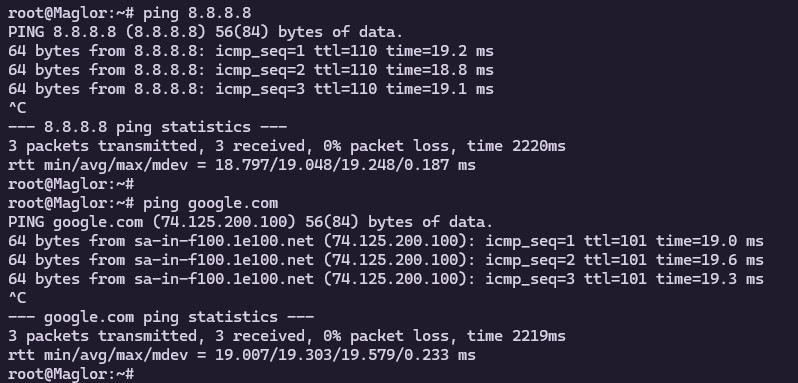

Di belakang proses yang terjadi pada proses di atas adalah bahwa Eonwe (router) telah menyadari request berasal dari jaringan lokal (10.72.x.x), sehingga meneruskan request tersebut ke internet, dengan menggunakan Publik IP Address yang dimiliki oleh Eonwe sendiri.

## 3. Resolver Client

**Goal:** Memastikan client dapat saling berkomunikasi lintas jalur dan memiliki resolver 192.168.122.1.

### 3.1 Konfigurasi

**Client**

```
auto eth0
iface eth0 inet static
	address 10.72.x.y
	netmask 255.255.255.0
	gateway 10.72.x.1
        up echo "nameserver 10.72.3.3" > /etc/resolv.conf
        up echo "nameserver 10.72.3.4" >> /etc/resolv.conf
        up echo "nameserver 192.168.122.1" >> /etc/resolv.conf
```

-   `echo "nameserver 192.168.122.1" >> /etc/resolv.conf`: memastikan client sendiri terhubung pada internet.

### 3.3 Testing

Sesuai dengan konsep yang telah dijelaskan pada soal nomor 2, keberhasilan pada soal ini dapat diuji dengan mudah juga dengan menggunakan `ping` menuju `google.com`. Apabila IP Address dari DNS Server telah disimpan oleh Client, maka seharusnya Client mengetahui bahwa request ditujukan pada IP Address Google dan request akan diteruskan menuju internet melalui Eonwe.

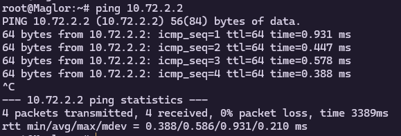

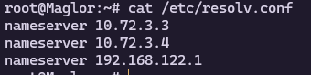

## 4. Pembuatan Zona DNS

**Goal:** Membangun zona Tirion/ns1 (master) dan Valmar/ns2 (slave), dan berbagai tambahan yang lainnya.

### 4.1 Script Konfigurasi

Pada nomor ini, dapat dijalankan kedua script di bawah ini untuk mempermudah konfigurasi zona pada Tirion dan Valmar.

**Tirion (master)**

```
echo "konfigurasi options"
cat <<EOF > /etc/bind/named.conf.options
options {
        directory "/var/cache/bind";

        forwarders {
                192.168.122.1;
        };
};
EOF

echo "master zone k17.com"
cat <<EOF > /etc/bind/named.conf.local
zone "k17.com" {
        type master;
        file "/etc/bind/db.k17.com";
        allow-transfer { 10.72.3.4; };
        notify yes;
};
EOF

echo "Membuat file zona db.k17.com..."
cat <<EOF > /etc/bind/db.k17.com

\$TTL    604800
@       IN      SOA     ns1.k17.com. root.k17.com. (
                        2024101301      ; Serial (YYYYMMDDNN)
                         604800         ; Refresh
                          86400         ; Retry
                        2419200         ; Expire
                         604800 )       ; Negative Cache TTL

; Name Servers
@       IN      NS      ns1.k17.com.
@       IN      NS      ns2.k17.com.

; A Records
@       IN      A       10.72.3.2       ; apex (k17.com) -> Sirion
ns1     IN      A       10.72.3.3       ; ns1.k17.com -> Tirion
ns2     IN      A       10.72.3.4       ; ns2.k17.com -> Valmar
sirion  IN      A       10.72.3.2       ; sirion.k17.com -> Sirion
lindon  IN      A       10.72.3.5       ; lindon.k17.com -> Lindon
vingilot IN     A       10.72.3.6       ; vingilot.k17.com -> Vingilot
earendil IN     A       10.72.1.2
elwing  IN      A       10.72.1.3
cirdan  IN      A       10.72.2.2
elrond  IN      A       10.72.2.3
maglor IN       A       10.72.2.4
EOF

# echo "Memeriksa sintaks konfigurasi..."
# named-checkconf
# named-checkzone k17.com /etc/bind/db.k17.com

echo "Service named restart"
service named restart
```

-   Script di atas melakukan konfigurasi pada `/etc/bind/named.conf.options`, `/etc/bind/named.conf.local`, dan `/etc/bind/db.k17.com`.
-   `/etc/bind/named.conf.options`: Konfigurasi pada file ini ditujukan untuk mengatur perilaku global BIND9.
-   `/etc/bind/named.conf.local`: Konfigurasi pada file ini ditujukan untuk mendaftarkan zona atau domain yang akan dikelola.
-   `/etc/bind/db.k17.com`: File ini merupakan suatu "buku telepon" yang mengandung berbagai IP Address yang dihubungkan dengan nama-nama domain yang dimiliki IP Address tersebut.

**Valmar (slave)**

```
echo "Mendeklarasikan zona slave k17.com..."
cat << EOF > /etc/bind/named.conf.local
zone "k17.com" {
        type slave;
        masters { 10.72.3.3; };
        file "/var/lib/bind/db.k17.com";
};
EOF

# echo "Memeriksa sintaks konfigurasi..."
# named-checkconf

echo "Restart layanan BIND9 (akan memulai proses transfer zona dari master)..."
service named restart

echo "Konfigurasi Valmar selesai."
```

### 4.2 Tujuan & Konsep

Tujuan dari soal ini adalah untuk membangun sistem DNS Internal kita sendiri yang andal sehingga behenti menggunaka DNS publik (`192.168.122.1`) untuk nama-nama domain internal. Berikut merupakan penjelasan konsep-konsep yang digunakan untuk menjawab soal ini.

-   **DNS (Domain Name System):** Sederhananya, ini adalah "buku telepon" internet yang menerjemahkan nama yang mudah diingat (seperti google.com) menjadi alamat IP (seperti 142.250.70.142).
-   **DNS Master (Tirion):** Ditugaskan sebagai server Authoritative Master. Ini berarti dia memegang "buku telepon" asli untuk zona k17.com. Setiap perubahan data (penambahan nama/IP) harus dilakukan di sini.
-   **DNS Slave (Valmar):** Ditugaskan sebagai server Slave. Tujuannya adalah untuk redundansi (cadangan). Valmar akan secara otomatis menyalin seluruh "buku telepon" dari Tirion. Jika Tirion mati, Valmar bisa mengambil alih.
-   **Zone Transfer:** Ini adalah proses penyalinan "buku telepon" dari Master ke Slave. Agar ini berhasil, kita harus:
    -   Memberi tahu Tirion siapa yang boleh menyalin (dengan allow-transfer ke IP Valmar).
    -   Memberi tahu Tirion untuk proaktif memberi kabar jika ada data baru (dengan notify yes; ).
    -   Memberi tahu Valmar siapa Masternya (dengan masters { ... }; ).
-   **Forwarders:** Forwarders adalah instruksi untuk Tirion agar "jika ada yang bertanya dan kamu tidak tahu jawabannya, teruskan pertanyaan itu ke 192.168.122.1.". Kita tetap ingin server DNS kita bisa mencari alamat eksternal (seperti google.com).

### 4.3 Testing

Keberhasilan pada soal ini dapat diuji dengan menggunakan `ping` dimana terlihat melalui IP Address mana packet ditujukan. Tetapi sebelumnya perlu dikonfigurasi ulang untuk resolver terurut seperti di gambar di bawaeh ini.


Lalu diuji coba menggunakan ping, dapat terlihat bahwa IP Address yang digunakan untuk mencari tahu `ns1.k17.com` dengan menggunakan IP Address dari DNS Server Internal.

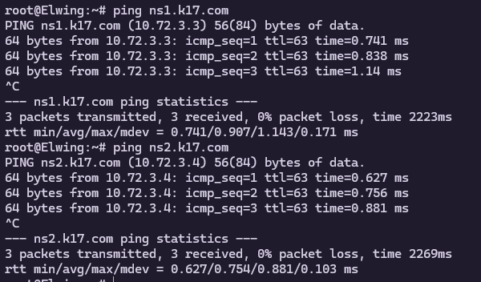

Untuk informasi lebih lanjut dapat dilihat menggunakan `dig`.

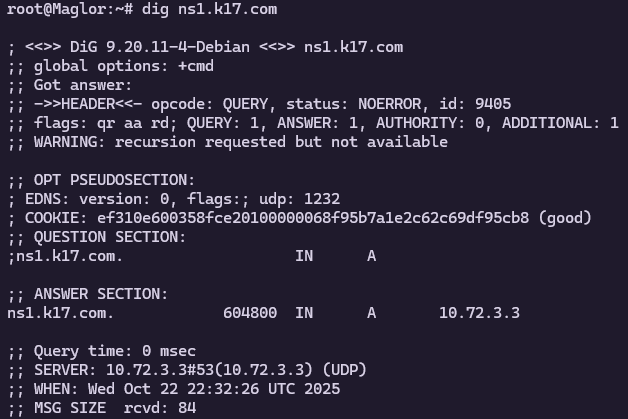

Untuk membuktikan bahwa DNS Server dari Zona Master maupun Slave sudah bekerja dapat dilihat melalui gambar di bawah ini.

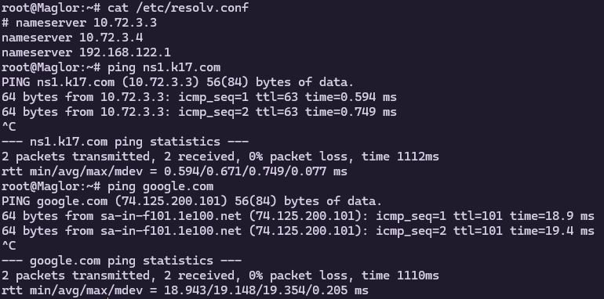

## 5. Address Record Untuk Tiap Client

**Goal:** Menambahkan tiap nama dari client sebagai domain yang merujuk ke IP Address client masing-masing.

### 5.1 Konfigurasi

**Tirion (master)**

```
echo "konfigurasi options"
cat <<EOF > /etc/bind/named.conf.options
options {
        directory "/var/cache/bind";

        forwarders {
                192.168.122.1;
        };
};
EOF

echo "master zone k17.com"
cat <<EOF > /etc/bind/named.conf.local
zone "k17.com" {
        type master;
        file "/etc/bind/db.k17.com";
        allow-transfer { 10.72.3.4; };
        notify yes;
};
EOF

echo "Membuat file zona db.k17.com..."
cat <<EOF > /etc/bind/db.k17.com

\$TTL    604800
@       IN      SOA     ns1.k17.com. root.k17.com. (
                        2024101301      ; Serial (YYYYMMDDNN)
                         604800         ; Refresh
                          86400         ; Retry
                        2419200         ; Expire
                         604800 )       ; Negative Cache TTL

; Name Servers
@       IN      NS      ns1.k17.com.
@       IN      NS      ns2.k17.com.

; A Records
@       IN      A       10.72.3.2       ; apex (k17.com) -> Sirion
ns1     IN      A       10.72.3.3       ; ns1.k17.com -> Tirion
ns2     IN      A       10.72.3.4       ; ns2.k17.com -> Valmar
sirion  IN      A       10.72.3.2       ; sirion.k17.com -> Sirion
lindon  IN      A       10.72.3.5       ; lindon.k17.com -> Lindon
vingilot IN     A       10.72.3.6       ; vingilot.k17.com -> Vingilot
earendil IN     A       10.72.1.2
elwing  IN      A       10.72.1.3
cirdan  IN      A       10.72.2.2
elrond  IN      A       10.72.2.3
maglor IN       A       10.72.2.4
EOF

# echo "Memeriksa sintaks konfigurasi..."
# named-checkconf
# named-checkzone k17.com /etc/bind/db.k17.com

echo "Service named restart"
service named restart
```

### 5.2 Testing

Menguji keberhasilan pada soal ini dapat dilakukan dengan mudah dengan menggunakan `ping` untuk menguji bahwa tersambung atau tidaknya request yang diinginkan menuju `[client].k17.com`.

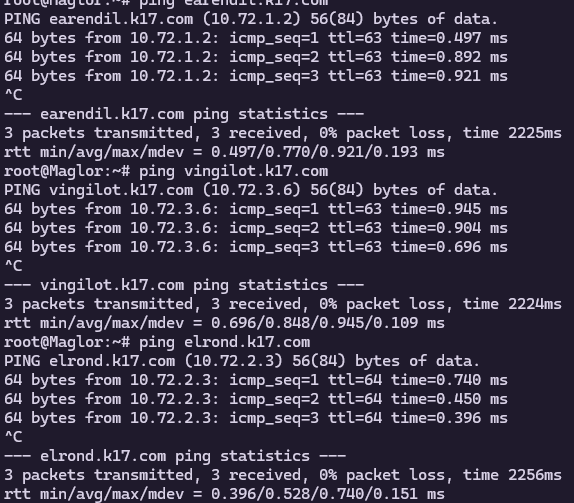

Pengecualian dari Client yang menjadi DNS Server sendiri juga diterapkan.

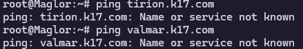

## 6. Memastikan Zona Transfer

**Goal:** Memastikan Zona Transfer berjalan

### 6.1 Testing

Menggunakan script sebelumnya dapat diketahui bahwa zona file untuk Slave kami taruh pada `/var/lib/bind/db.k17.com`. Untuk mengetahui file zone sudah bekerja dengan baik, dapat dilakukan perubahan pada file `db.k17.com` di Master (Sirion).

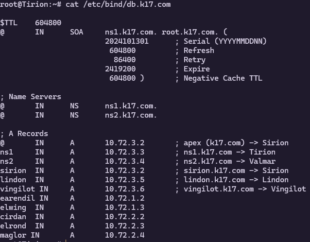

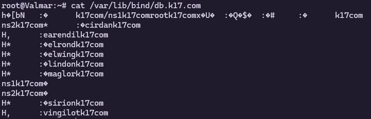


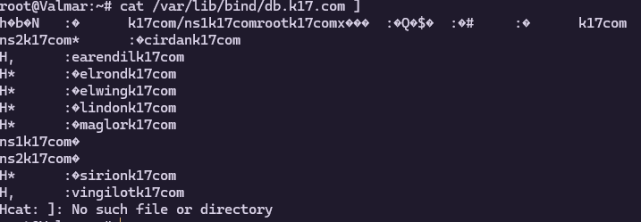

## 7. Serial Dinamis dan CNAME

**Goal:** Membuat serial menjadi dinamis dan mengupdate secara otomatis, serta menambahkan CNAME untuk sirion, lindon, dan vingilot, dimana lindon sebagai web statis dan vingilot sebagai web dinamis.

### 7.1 Konfigurasi

**Tirion**

```
SERIAL=$(date +%Y%m%d)01

echo "Mengkonfigurasi /etc/bind/named.conf.options..."
cat <<EOF > /etc/bind/named.conf.options
options {
        directory "/var/cache/bind";
        forwarders {
                192.168.122.1;
        };
        allow-query { any; };
        auth-nxdomain no;
        listen-on-v6 { any; };
};
EOF

echo "Mengkonfigurasi /etc/bind/named.conf.local (Master Zone)..."
cat <<EOF > /etc/bind/named.conf.local
// Mendeklarasikan zona master k17.com
zone "k17.com" {
        type master;
        file "/etc/bind/db.k17.com";
        allow-transfer { 10.72.3.4; };
        notify yes;
};
EOF

echo "Membuat file zona db.k17.com..."
cat <<EOF > /etc/bind/db.k17.com
\$TTL    604800
@       IN      SOA     ns1.k17.com. root.k17.com. (
                        $SERIAL         ; Serial (Dibuat otomatis)
                         604800         ; Refresh
                          86400         ; Retry
                        2419200         ; Expire
                         604800 )       ; Negative Cache TTL
;
; --- Name Servers ---
@       IN      NS      ns1.k17.com.
@       IN      NS      ns2.k17.com.

; --- A Records ---
; Soal 4: Record untuk Apex, ns1, dan ns2
@       IN      A       10.72.3.2       ; apex (k17.com) -> Sirion
ns1     IN      A       10.72.3.3       ; ns1.k17.com -> Tirion
ns2     IN      A       10.72.3.4       ; ns2.k17.com -> Valmar
;Record untuk semua host
earendil IN     A       10.72.1.2
elwing  IN      A       10.72.1.3
cirdan  IN      A       10.72.2.2
elrond  IN      A       10.72.2.3
maglor  IN      A       10.72.2.4
sirion  IN      A       10.72.3.2
lindon  IN      A       10.72.3.5
vingilot IN     A       10.72.3.6

; --- CNAME Records ---
www     IN      CNAME   sirion.k17.com.
static  IN      CNAME   lindon.k17.com.
app     IN      CNAME   vingilot.k17.com.
EOF
# echo "Memeriksa sintaks konfigurasi..."
# named-checkconf
# named-checkzone k17.com /etc/bind/db.k17.com

echo "Merestart layanan BIND9..."
service named restart

echo "Konfigurasi Tirion (Master) selesai."
```

-   Dengan adanya variabel `SERIAL=$(date +%Y%m%d)01` maka serial akan secara otomatis memperbarui nillainya setiap ada perubahan yang terjadi file konfigurasi.
-   Penambahan CNAME Records juga ditujukan untuk dapat meneruskan www, static, dan app menuju sirion, lindon, dan vingilot secara berurutan.

**Valmar**

```
#!/bin/bash
echo "Mengkonfigurasi /etc/bind/named.conf.options (Slave)..."
cat <<EOF > /etc/bind/named.conf.options
options {
        directory "/var/cache/bind";
        allow-query { any; };
        auth-nxdomain no;
        listen-on-v6 { any; };
};
EOF

echo "Mendeklarasikan zona slave k17.com..."
cat << EOF > /etc/bind/named.conf.local
zone "k17.com" {
        type slave;
        masters { 10.72.3.3; };
        file "/var/lib/bind/db.k17.com";
};
EOF

# echo "Memeriksa sintaks konfigurasi..."
# named-checkconf

echo "Merestart layanan BIND9 (akan memulai proses transfer zona)..."
service named restart

echo "Konfigurasi Valmar (Slave) selesai."
```

### 7.2 Testing

Menguji keberhasilan ini dapat dengan mudah menggunakan `ping` dan `dig` seperti berikut di bawah ini.

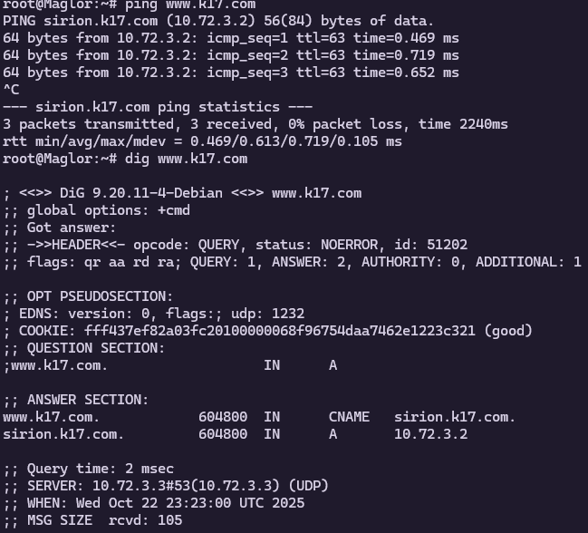

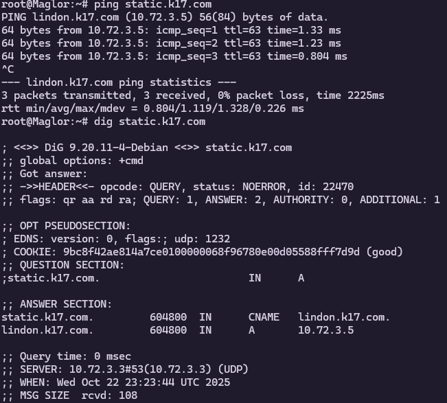

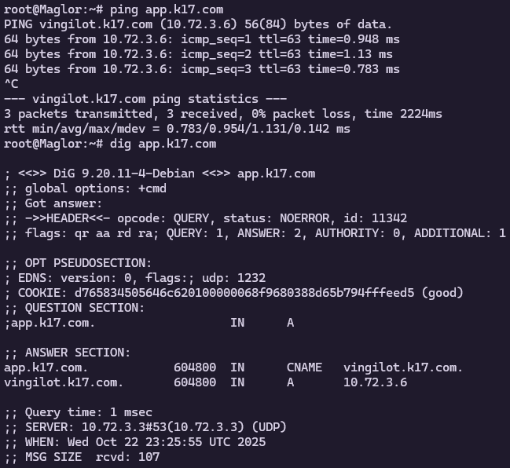

## 8. Reverse Zone

**Goal:** Membuat suatu Reverse Zone untuk mencari tahu nama IP Address ketika yang diketahui hanya IP Address.

### 8.1 Konfigurasi

**Tirion**

```
SERIAL=$(date +%Y%m%d)01

echo "Mengkonfigurasi /etc/bind/named.conf.options..."
cat <<EOF > /etc/bind/named.conf.options
options {
        directory "/var/cache/bind";
        forwarders {
                192.168.122.1;
        };
        allow-query { any; };
        auth-nxdomain no;
        listen-on-v6 { any; };
};
EOF


echo "Mengkonfigurasi /etc/bind/named.conf.local (Master Zone)..."
cat <<EOF > /etc/bind/named.conf.local
zone "k17.com" {
        type master;
        file "/etc/bind/db.k17.com";
        allow-transfer { 10.72.3.4; };
        notify yes;
};

zone "3.72.10.in-addr.arpa" {
        type master;
        file "/etc/bind/db.10.72.3";
        allow-transfer { 10.72.3.4; }; // Izinkan Valmar
        notify yes;
};
EOF


echo "Membuat file zona db.k17.com..."
cat <<EOF > /etc/bind/db.k17.com
\$TTL    604800
@       IN      SOA     ns1.k17.com. root.k17.com. (
                        $SERIAL         ; Serial (Dibuat otomatis)
                         604800         ; Refresh
                          86400         ; Retry
                        2419200         ; Expire
                         604800 )       ; Negative Cache TTL
;
; --- Name Servers ---
@       IN      NS      ns1.k17.com.
@       IN      NS      ns2.k17.com.

; --- A Records ---
; Soal 4: Record untuk Apex, ns1, dan ns2
@       IN      A       10.72.3.2       ; apex (k17.com) -> Sirion
ns1     IN      A       10.72.3.3       ; ns1.k17.com -> Tirion
ns2     IN      A       10.72.3.4       ; ns2.k17.com -> Valmar
;Record untuk semua host
earendil IN     A       10.72.1.2
elwing  IN      A       10.72.1.3
cirdan  IN      A       10.72.2.2
elrond  IN      A       10.72.2.3
maglor  IN      A       10.72.2.4
sirion  IN      A       10.72.3.2
lindon  IN      A       10.72.3.5
vingilot IN     A       10.72.3.6

; --- CNAME Records ---
www     IN      CNAME   sirion.k17.com.
static  IN      CNAME   lindon.k17.com.
app     IN      CNAME   vingilot.k17.com.
EOF

echo "Membuat file reverse zone db.10.72.3..."
cat <<EOF > /etc/bind/db.10.72.3
\$TTL    604800
@       IN      SOA     ns1.k17.com. root.k17.com. (
                        $SERIAL         ; Serial (Harus sama dengan forward zone)
                         604800         ; Refresh
                          86400         ; Retry
                        2419200         ; Expire
                         604800 )       ; Negative Cache TTL
;
; Name Servers
@       IN      NS      ns1.k17.com.
@       IN      NS      ns2.k17.com.

; --- PTR Records ---
; Memetakan IP kembali ke NAMA
; Hanya oktet terakhir dari IP yang ditulis
2       IN      PTR     sirion.k17.com.   ; 10.72.3.2
5       IN      PTR     lindon.k17.com.   ; 10.72.3.5
6       IN      PTR     vingilot.k17.com. ; 10.72.3.6
EOF

# echo "Memeriksa sintaks konfigurasi..."
# named-checkconf
# named-checkzone k17.com /etc/bind/db.k17.com

echo "Merestart layanan BIND9..."
service named restart

echo "Konfigurasi Tirion (Master) selesai."
```

-   Sama seperti langkah pada nomor 4, script di atas ditujukan untuk membuat zona baru, yaitu _reverse zone_. Reverse zone ini sama seperti membuat "buku telepon" tetapi terbalik, bukan dari nama &rarr; IP Address, melainkan IP Address &rarr; nama.

**Valmar**

```
#!/bin/bash
echo "Mengkonfigurasi /etc/bind/named.conf.options (Slave)..."
cat <<EOF > /etc/bind/named.conf.options
options {
        directory "/var/cache/bind";
        allow-query { any; };
        auth-nxdomain no;
        listen-on-v6 { any; };
};
EOF

echo "Mendeklarasikan zona slave k17.com..."
cat << EOF > /etc/bind/named.conf.local
zone "k17.com" {
        type slave;
        masters { 10.72.3.3; };
        file "/var/lib/bind/db.k17.com";
};

zone "3.72.10.in-addr.arpa" {
        type slave;
        masters { 10.72.3.3; };
        file "/var/lib/bind/db.10.72.3";
};
EOF

# echo "Memeriksa sintaks konfigurasi..."
# named-checkconf

echo "Merestart layanan BIND9 (akan memulai proses transfer zona)..."
service named restart

echo "Konfigurasi Valmar (Slave) selesai."
```

### 8.2 Testing

Menguji keberhasilan soal ini dengan mudah dapat dilakukan dengan `dig` dengan flag `-x` yang menandakan _reverse_. Dapat dilihat dari gambar di bawah, dapat ditemukan nama dari alamat IP Address yang sedang dicari.

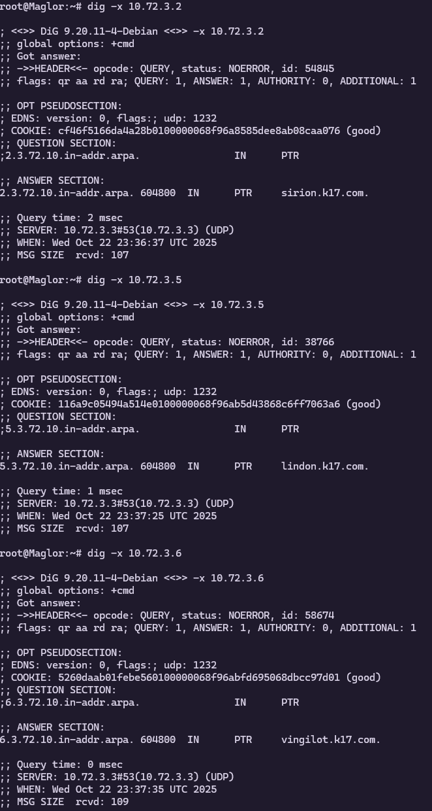

## 9. Web Statis

**Goal:** Membuat web statis berjalan di Lindon, dimana dapat menelusuri directory serta dapat diakses melalui hostname bukan IP.

### 9.1 Script

```
apt-get update
apt-get install -y nginx

mkdir -p /var/www/static/annals

# File dummy web
echo "<html><body><h1>Ini Lindon (Static Server)</h1><p><a href=\"/annals/\">Lihat Arsip</a></p></body></html>" > /var/www/static/index.html

# File dummy txt
echo "Catatan sejarah, hari pertama." > /var/www/static/annals/catatan_001.txt
echo "Catatan sejarah, hari kedua." > /var/www/static/annals/catatan_002.txt

echo "Membuat konfigurasi Nginx untuk static.k17.com..."
cat <<EOF > /etc/nginx/sites-available/static.conf
server {
    listen 80;
    server_name static.k17.com; # nama server
    root /var/www/static;
    index index.html;
    location / {
        try_files \$uri \$uri/ =404;
    }

    location /annals/ {
        autoindex on;
    }
}
EOF

# Activate symlink and delete default configuration
ln -s /etc/nginx/sites-available/static.conf /etc/nginx/sites-enabled/
rm -f /etc/nginx/sites-enabled/default

service nginx restart
```

### 9.2 Testing


## 11. Reverse Proxy

**Goal:** Menerapkan _path-based routing_ dengan node **Sirion** berdiri sebagai reverse proxy, **Lindon** sebagai server static dengan _web content_ yang dapat diakses melalui `/static`, dan **Vingilot** sebagai server web aplikasi yang dapat diakses melalui `/app`.

### 11.1 Konfigurasi Lindon & Vingilot

Pada node **Lindon**, kita perlu menambahkan `index.html` sebagai agar kita dapat membedakan ketika _reverse proxy_ berusaha mengakses beberapa server yang berbeda.

```bash
echo "<h1>Halo dari Lindon (/static)</h1>" | tee /var/www/html/index.html
```

Setelah menambahkan file `index.html`, jangan lupa untuk melakukan _restart_ pada layanan nginx.

```bash
service nginx restart
```

Lakukan hal yang serupa pada node **Vingilot** dengan perintah berikut:

```bash
echo "<h1>Halo dari Vingilot (/app)</h1>" | tee /var/www/html/index.html
```

### 11.2 Konfigurasi Sirion

Pada node **Sirion**, kita akan melakukan konfigurasi sebagai _reverse proxy_ dengan mengubah file konfigurasi nginx milik **Sirion** atau membuat konfigurasi baru dengan menjalankan perintah berikut:

```bash
nano /etc/nginx/sites-available/reverse_proxy.conf
```

lalu, tulis ulang konfigurasi sebagai berikut:

```nginx
server {
    listen 80;
    server_name _;

    # Routing ke Lindon
    location /static/ {
        proxy_pass http://10.72.3.5/;
    }

    # Routing ke Vingilot
    location /app/ {
        proxy_pass http://10.72.3.6/;
    }
}
```

lalu, lakukan aktivasi terhadap konfigurasi tersebut dan _restart_ layanan nginx pada node **Sirion**.

```bash
ln -s /etc/nginx/sites-available/reverse_proxy.conf /etc/nginx/sites-enabled/
nginx -t
service nginx restart
```

> [!NOTE]
> Jika anda membuat file konfigurasi baru, harap menghapus konfigurasi default nginx untuk mencegah terjadinya _conflicts_ ketika dijalankan. Gunakan perintah berikut untuk menghapus file default: `rm /etc/nginx/sites-enabled/default`.

### 11.3 Testing

Gunakan perintah `curl` dari node **Sirion** untuk melakukan test pada routing:

```bash
curl http://10.72.3.2/static/
curl http://10.72.3.2/app/
```

Masing-masing dari perintah tersebut, jika berhasil, seharusnya akan menampilkan _output_ sesuai dengan apa yang sudah kita masukkan pada index.html masing-masing node.

```
<h1>Halo dari Lindon (/static)</h1>
<h1>Halo dari Vingilot (/app)</h1>
```

## 12. Secure Routing

**Goal:** Mencegah akses terlarang untuk _route_ `/admin` dengan autentikasi dasar pada nginx.

### 12.1 Install Dependensi

Agar dapat memanfaatkan fitur autentikasi dasar menggunakan `htpasswd`, kita perlu dependensi menginstall `apache2-utils` pada node **Sirion**.

```bash
apt update
apt install nginx apache2-utils
```

### 12.2 Konfigurasi

Langkah pertama, kita perlu membuat file password yang akan menyimpan kredensial login untuk bagian `/admin`.

```bash
 htpasswd -c /etc/nginx/.htpasswd admin
```

Setelah menjalankan perintah tersebut, kita akan diminta untuk memasukkan kredensial password yang akan kita gunakan. Kemudian, kita juga perlu menambahkan konfigurasi untuk _path_ `/admin` dengan konfigurasi keamanan. Tambahkan konfigurasi berikut pada file konfigurasi yang sama di soal sebelumnya:

```nginx
location /admin {
    auth_basic "Restricted Area";
    auth_basic_user_file /etc/nginx/.htpasswd;

    proxy_pass http://10.72.3.2/;
}
```

lalu, lakukan aktivasi terhadap konfigurasi tersebut dan _restart_ layanan nginx pada node **Sirion**.

```bash
ln -s /etc/nginx/sites-available/reverse_proxy.conf /etc/nginx/sites-enabled/
nginx -t
service nginx restart
```

### 12.3 Testing

Ketika kita mencoba mengakses bagian `/admin` menggunakan perintah berikut:

```bash
curl http://10.72.3.2/admin/
```

Kita akan mendapatkan pesan `401 Authorization Required` yang menandakan perlu adanya _authorization_ dengan proses autentikasi dengan kredensial yang sudah ditetapkan. Akses dengan kredensial dapat dilakukan dengan perintah berikut:

```bash
curl -u admin:sirion123 http://10.72.3.2/admin/
```

Seharusnya, jika berjalan dengan baik, perintah tersebut akan memberikan output 200 OK.

13. Redirect
    **Goal:** Melakukan _redirect_ untuk akses ke IP **Sirion** maupun **sirion.K17.com** harus melalui **www.K17.com** sebagai hostname kanonik.

### 13.1 Edit Konfigurasi

Langkah pertama, kita perlu mengubah konfigurasi pada file konfigurasi nginx yang kita pakai pada soal sebelumnya. Buka file nginx dan ubah konfigurasi menjadi seperti berikut:

```nginx
server {
    listen 80;
    server_name 10.72.3.2 sirion.K17.com;

    return 301 http://www.K17.com$request_uri;
}

# Main site configuration
server {
    listen 80;
    server_name www.K17.com;

    # Protected admin area
    location /admin {
        auth_basic "Restricted Area";
        auth_basic_user_file /etc/nginx/.htpasswd;

        proxy_pass http://10.72.3.2/;
    }

    # Routing ke Lindon
    location /static/ {
        proxy_pass http://10.72.3.5/;
    }

    # Routing ke Vingilot
    location /app/ {
        proxy_pass http://10.72.3.6/;
    }
}
```

Pada `/etc/hosts` tambahkan juga domain secara manual supaya node dapat mengenali domain yang dituju. Gunakan perintah berikut:

```bash
nano /etc/hosts
```

Tambahkan konfigurasi berikut pada file:

```
10.72.3.2   sirion.<xxxx>.com
10.72.3.2   www.<xxxx>.com
```

lalu, lakukan aktivasi terhadap konfigurasi tersebut dan _restart_ layanan nginx pada node **Sirion**.

```bash
ln -s /etc/nginx/sites-available/reverse_proxy.conf /etc/nginx/sites-enabled/
nginx -t
service nginx restart
```

### 13.2 Testing

Ketika kita melakukan `curl` langsung ke alamat IP dengan perintah berikut:

```bash
curl -I http://10.72.3.2/
curl -I http://sirion.K17.com/
```

Jika berhasil, perintah akan memunculkan pesan dengan kode `301`. Sedangkan, jika kita mengakses dengan perintah berikut:

```bash
curl -I http://www.K17.com/
```

Perintah akan mengeluarkan pesan dengan kode `200` yang menandakan _routing_ berhasil. Pastikan juga kita dapat mengakses bagian lain seperti:

```bash
curl -I http://www.K17.com/admin
curl -I http://www.K17.com/static
curl -I http://www.K17.com/app
```

## 14. Log IP

**Goal:** Memastikan access log aplikasi di **Vingilot** mencatat IP address klien asli saat lalu lintas melewati **Sirion**.

### 14.1 Konfigurasi

Pada node **Sirion**, tambahkan konfigurasi berikut untuk setiap routing yang bukan langsung ke Sirion (route ke IP **Lindon** dan **Vingilot**)

```nginx
proxy_set_header Host $host;
proxy_set_header X-Real-IP $remote_addr;
proxy_set_header X-Forwarded-For $proxy_add_x_forwaded_for;
proxy_set_header X-Forwarded-Proto $scheme;
```

Kemudian, pada node **Vingilot**, tambahkan konfigurasi berikut pada file `/etc/nignx/nginx.conf` untuk menangkap IP klienasli yang melintasi **Sirion**:

```nginx
http {
    # konfigurasi global lain...

    real_ip_header X-Forwarded-For;
    set_real_ip_from 10.72.3.2;
}
```

Setelah menyimpan file konfigurasi, lakukan verifikasi dan _restart_ pada layanan nginx:

```bash
nginx -t
service nginx restart
```

### 14.2 Testing

Setelah melakukan konfigurasi, kita dapat melakukan tes dengan menjalankan perintah berikut pada node **Vingilot** untuk mendapatkan log terkait lalu lintas pada jaringan yang melewati **Sirion**:

```bash
tail -f /var/log/nginx/access.log
```

Lalu, ketika kita melakukan `curl` pada node client:

```bash
curl http://www.K17.com/app/
```

Pada terminal node **Vingilot** akan ditampilkan input log baru sebagai berikut:


## 15. Uji Gelombang

**Goal:** Melakukan pengujian menggunakan **ApacheBench (ab)** dan merangkum hasil dalam tabel ringkas.

### 15.1 Konfigurasi

Kita perlu menginstall **ApacheBench** pada node **Elrond** untuk melakukan pengujian gelombang.

```bash
apt install apache2-utils
```

Setelah **ApacheBench** telah terinstall, kita perlu menambahkan konfigurasi DNS pada `/etc/hosts` menggunakan perintah `nano`. Tambahkan konfigurasi berikut pada file:

```
10.72.3.2         www.K17.com
```

### 15.2 Testing

Jika konfigurasi sudah dilakukan, selanjutnya kita dapat melakukan testing dengan perintah berikut untuk `/app`:

```bash
ab -n 500 -c 10 http://www.K17.com/app/
```

dan perintah berikut untuk `/static`:

```bash
ab -n 500 -c 10 http://www.K17.com/static/
```

Catat output yang didapatkan, atau juga dapat dilakukan perintah append ke dalam file untuk otomatis mencatat output dengan perintah berikut:

```bash
ab -n 500 -c 10 http://www.K17.com/app/ >> catatan.log
ab -n 500 -c 10 http://www.K17.com/static/ >> catatan.log
```

Jika output yang didapatkan kita ringkas ke dalam tabel dengan variabel yang diminta, maka akan mendapatkan hasil seperti tabel di bawah:

| Endpoint   | Req/sec     | Avg Time/Req (ms) | Transfer Rate (KB/s) |
| ---------- | ----------- | ----------------- | -------------------- |
| `/app/`    | **4670.02** | **2.141**         | **1181.19**          |
| `/static/` | **4312.32** | **2.319**         | **1094.92**          |

## 16. BIND

**Goal:** Mengubah _A Record_ **Lindon**, menaikkan SOA serial pada **Tirion** dan memastikan **Valmar** ter-sinkron sebagai slave.

### 16.1 Konfigurasi

Pada node **Tirion**, ubah konfigurasi pada file _zone_ `/etc/bind/k17/k17.com` menjadi sebagai berikut:

```
$TTL    604800
@       IN      SOA     ns1.k17.com. root.k17.com. (
                        2025100402 ; Serial
                        # ... baris SOA lainnya
                        )

# ... (record NS dan A lainnya) ...

lindon      30 IN       A      10.72.3.7   ;

# ... (record CNAME) ...
```

Di bagian SOA, naikan nomor serial dari konfigurasi sebelumnya. Tambahkan juga _A Record_ untuk **Lindon** pada konfigurasi file seperti di atas. Setelah itu _restart_ layanan `bind9` untuk menerapkan perubahan pada file _zone_ tersebut:

```bash
service bind9 restart
```

### 16.2 Testing

Jalankan perintah `dig static.k17.com` pada node klien dan jika klien menerima IP baru **Lindon** (10.72.3.7), maka perubahan _A Record_ di server DNS **Tirion** berhasil.

## 17. Service Auto-Start Configuration

**Goal:** Memastikan layanan inti pada setiap server (bind9 di ns1/ns2, nginx di **Sirion/Lindon**, dan PHP-FPM di **Vingilot**) dapat berjalan otomatis setelah reboot, untuk menjamin service resiliency tanpa intervensi manual.

### 17.1 Konfigurasi

Lakukan aktivasi layanan inti pada masing-masing node menggunakan perintah berikut pada node **Tirion** dan **Valmar**:

```bash
update-rc.d bind9 defaults
```

Pada node **Sirion**, aktifkan layanan **Nginx** dengan perintah berikut:

```bash
update-rc.d nginx defaults
```

Lalu, pada node **Lindon**, aktifkan layanan **Apache2** dengan perintah berikut:

```bash
update-rc.d apache2 defaults
```

Pada node **Vingilot**, aktifkan juga layanan **Apache2** dan **PHP-FPM** dengan perintah berikut:

```bash
update-rc.d apache2 defaults
update-rc.d php8.4-fpm defaults
```

### 17.2 Testing

Lakukan _reboot_ untuk setiap node pada GNS3 menggunakan _interface_ yang disediakan. Setelah sistem menyala kembali, pada node **Tirion**, jalankan perintah berikut:

```bash
service bind9 status
```

Jika didapat output `bind is running.` maka kita sudah berhasil melakukan konfigurasi _auto start_. Namun, jika output `bind is not running ... failed!` maka kemungkinan ada permasalahan pada _syntax_ atau izin akses.

## 18. TXT dan CNAME Record

**Goal:** Menambahkan _record TXT_ untuk `melkor.k17.com` berisi teks `"Morgoth (Melkor)"`, serta membuat record CNAME agar `morgoth.k17.com` menjadi alias yang menunjuk ke `melkor.k17.com.`. Kemudian, memverifikasi bahwa query TXT terhadap keduanya bekerja sesuai fungsi alias DNS.

### 18.1 Konfigurasi

Pada node **Tirion**, lakukan perubahan dengan menambahkan dua record baru ke _file zone_ `/etc/bind/k17/k17.com` sebagai berikut:

```
melkor       IN       TXT      "Morgoth (Melkor)"
morgoth      IN       CNAME    melkor.k17.com.
```

Setelah menambahkan record, naikan nomor serial SOA pada _file zone_ untuk menandai perubahan dan lakukan _restart_ pada layanan `bind9`:

```bash
service bind9 restart
```

### 18.2 Testing

Pada node klien, lakukan validasi dengan menjalankan perintah `dig` untuk memastikan kedua record bekerja sesuai harapan:

```bash
dig melkor.k17.com TXT
```

Jika konfigurasi record TXT berhasil diterapkan, akan didapatkan output sebagai berikut:

```
melkor.k17.com.   3600   IN   TXT   "Morgoth (Melkor)"
```

Kemudian, jalankan juga perintah berikut untuk tes konfigurasi CNAME:

```bash
dig morgoth.k17.com TXT
```

Jika konfigurasi berhasil, akan didapatkan output dengan 2 baris seperti berikut:

```
morgoth.k17.com.  3600   IN   CNAME   melkor.k17.com.
melkor.k17.com.   3600   IN   TXT     "Morgoth (Melkor)"
```

## 19. CNAME Alias

**Goal:** Menambahkan record CNAME agar `havens.k17.com` menjadi alias dari `www.k17.com`, kemudian memastikan bahwa resolusi DNS dan alur rute aplikasi melalui reverse proxy berfungsi dengan benar dari dua klien berbeda.

### 19.1 Konfigurasi

Pada node **Tirion**, tambahkan konfigurasi tambahan pada _file zone_ `/etc/bind/k17/k17.com`:

```
havens      IN       CNAME    www.k17.com.
```

Setelah itu, naikan nomor serial SOA untuk menandai perubahan dan lakukan _restart_ pada `bind9` untuk menerapkan perubahan pada konfigurasi:

```bash
service bind9 restart
```

### 19.2 Testing

Pada dua node klien yang berbeda, coba akses hostname baru `heavens.k17.com` dengan perintah berikut:

```bash
curl http://havens.k17.com/app/
```

Jika konfigurasi berhasil, kedua perintah `curl` di atas akan menampilkan output:

```
<h1>Halo dari Vingilot (/app)</h1>
```

## 20. Landing Page

**Goal:** Menyediakan halaman depan berjudul **“War of Wrath: Lindon bertahan”** di server **Sirion**, yang berfungsi sebagai portal utama untuk mengakses dua layanan di belakang _reverse proxy_, yaitu `/app` dan `/static`.

### 20.1 Konfigurasi

Pada node **Sirion**, buat file `index.html` sebagai tampilan _landing page_ dengan perintah berikut:

```bash
echo "<h1>War of Wrath: Lindon bertahan</h1>
<a href="http://www.k17.com/app">App</a>
<a href="http://www.k17.com/static">Static</a>" | tee /var/www/html/index.html
```

Karena Nginx pada Sirion telah dikonfigurasi sebelumnya untuk melayani file dari direktori `/var/www/html/` untuk path root `/`, tidak diperlukan perubahan konfigurasi tambahan pada Nginx. Namun, jika belum, bisa ditambahkan konfigurasi untuk path direktori yang diinginkan.

### 20.2 Testing

Pada node klien, lakukan akses ke _landing page_ dengan perintah `curl` sebagai berikut:

```bash
curl http://www.k17.com/
```

Perintah akan memberikan output berupa isi file dari `index.html` yang ada pada node **Sirion** di dalam direktori `/var/www/html/` seperti berikut:

```
<h1>War of Wrath: Lindon bertahan</h1>
<a href="http://www.k17.com/app">App</a>
<a href="http://www.k17.com/static">Static</a>
```
